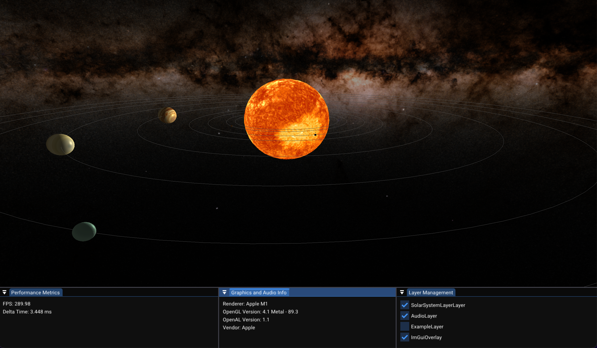

# OpenGL 4.1 Universe Simulator

This project purposefully uses **OpenGL 4.1** and **OpenAL 1.1**, which are the latest supported OpenGL and OpenAL versions on **macOS**. It ensures compatibility and performance on **Apple silicon** hardware.

<br/>

## **Project Details**

- **Language**: C++
- **Dependencies**:
  <br/>

  Install Apple's Command Line Tools for `gmake2`

  ```bash
  xcode-select --install
  ```

  - [Premake5](https://premake.github.io/) for building the project
  - [GLFW](https://www.glfw.org/) for windowing and input handling.
  - [GLM](https://github.com/g-truc/glm) for mathematics
  - [spdlog](https://github.com/gabime/spdlog) for fast C++ logging
  - [mpg123](https://github.com/gypified/libmpg123) fast console MPEG Audio Player and decoder library

   </br>

  ```bash
  brew install premake
  brew install glfw
  brew install glm
  brew install spdlog
  brew install mpg123
  ```

---

## Example Usage

```bash
premake5 gmake2
premake5 xcode4
premake5 vs2022
```

### Easiest way to build and run the project

```bash
premake5 gmake2
cd build
make
cd ..
./bin/{build-config}/macos-opengl
```

Alternatively, you can run the shell script to build and execute the project in one go

```bash
./generate.sh
```

---

## **Project dependencies (Manual)**

- [ImGui](https://github.com/ocornut/imgui/tree/docking) v1.91.7 WIP

---

### **Project Screenshots**



---

### **Completed Tasks**

1. [x] **Integrate SpdLog for Debugging**
2. [x] **BufferLayout class for VAO, VBO, EBO**
3. [x] **Sound and Audio Integration**

### **Phase 1: Editing Layer (Object Creation)**

4. [ ] **Imgui Overlay for Object Creation and Manipulation**

   - Develop a GUI overlay for creating and modifying objects like planets, stars, and comets.
   - Provide options to:
     - Add new objects with attributes (e.g., type, size, texture).
     - Modify existing objects interactively.
     - Delete unwanted objects.

5. [ ] **Save/Load Object Definitions**

   - Serialize object data (e.g., JSON, XML) to a file (`editing_objects.json`).
   - Load saved objects into the editing layer for progressive work.
   - Implement versioning in saved data to future-proof compatibility.

6. [ ] **Real-Time Feedback**

   - Display live previews of object changes in the world.
   - Ensure seamless interactivity between the GUI and the rendering engine.

7. [ ] **Switch to Universe Layer**
   - Add a toggle button in the GUI to switch from the **Editing Layer** to the **Universe Layer**.

### **Phase 2: Universe Layer (World Space and Logic)**

8. [ ] **Spatial Organization and Object Placement**

   - Implement a spatial data structure (e.g., quadtree, octree) for managing large-scale object placements.
   - Add drag-and-drop functionality for positioning objects in world space.

9. [ ] **Object Relationships**

   - Define parent-child relationships (e.g., moons orbiting planets).
   - Save these relationships in a separate file or section (`universe_layout.json`).

10. [ ] **Save/Load Universe Layouts**

    - Serialize spatial arrangements and relationships for persistence.
    - Load saved universe configurations for further editing or simulation.

11. [ ] **GUI for Universe Logic**

    - Provide controls for fine-tuning object placements and relationships.
    - Include real-time validation to avoid conflicts (e.g., overlapping objects).

12. [ ] **Switch to Simulation Mode**
    - Add a toggle to transition from **Universe Layer** to **Rendering Layer (Simulation Mode)**.

### **Phase 3: Rendering Layer (Simulation Mode)**

13. [ ] **Simulation Initialization**

    - Load object definitions and universe layouts.
    - Initialize rendering pipeline with proper shaders, textures, and object attributes.

14. [ ] **Physics Simulation**

    - Integrate a physics engine (e.g., Bullet Physics) to simulate gravitational interactions, collisions, and orbital dynamics.

15. [ ] **Camera and Controls**

    - Implement free-camera movement for roaming the universe.
    - Add a first-person or ship-like mode for immersive exploration.

16. [ ] **Transition Back to Editing or Universe Layers**
    - Allow seamless transitions back to editing or universe layers for iterative adjustments.

### **Phase 4: Planetary Interaction and Landing**

17. [ ] **Procedural Planet and Terrain Generation**

    - Use noise algorithms (e.g., Perlin noise) to generate planetary surfaces.
    - Add features like water bodies, vegetation, and atmospheric effects.

18. [ ] **Dynamic Transition System**

    - Implement seamless transitions between the universe and planetary surfaces.
    - Ensure minimal performance impact during transitions.

19. [ ] **Post-Processing Effects**
    - Enhance rendering quality with effects like bloom, HDR, and motion blur for realism.

### **Cross-Cutting Enhancements**

20. [ ] **Cross-Platform Compatibility**
    - Ensure compatibility on macOS, Windows, and Linux.
